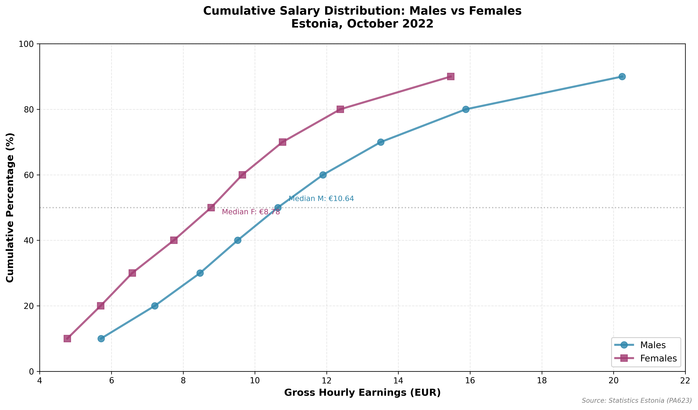

# Gender Pay Gap Analysis: Cumulative Salary Distribution in Estonia

## Executive Summary

This analysis examines the cumulative salary distribution of male and female employees in Estonia using data from October 2022. The analysis reveals a **persistent gender pay gap across all income levels**, ranging from 16.5% to 23.6%, with the gap widening at higher income levels.

**Key Findings:**
- Median hourly earnings: Males €10.64/hour vs Females €8.78/hour (17.5% gap)
- The gender pay gap increases at higher income levels, reaching 23.6% at the 90th percentile
- At every decile of the income distribution, males earn more than females
- The smallest gap (16.5%) occurs at the 10th percentile (lowest earners)
- The largest gap (23.6%) occurs at the 90th percentile (highest earners)

---

## Data Sources and Methodology

### Data Source
- **Source**: Statistics Estonia (Statistikaamet)
- **Table ID**: PA623
- **Title**: Gross Hourly Earnings and Deciles of Full-Time and Part-Time Employees by Sex and Major Group of Occupation, October
- **Reference Period**: October 2022
- **Last Updated**: July 2, 2024

### Methodology

**Data Collection:**
- Collected from economically active units (enterprises, institutions, and organizations)
- Excludes economic units without employees
- Based on the Business Register for Statistical Purposes
- Survey conducted annually in October

**Earnings Definition:**
Gross hourly earnings include:
- Time-rate and piece-rate payments
- Additional remuneration for overtime, night work, and holiday work
- Bonuses for work in difficult/unhealthy conditions
- Monthly bonuses
- Regular additional remuneration for qualifications, language skills, and length of service

Excluded from earnings:
- Quarterly and annual bonuses
- Christmas allowances
- Irregular bonuses and allowances
- Payments in kind
- Severance payments and sick leave payments

**Statistical Methodology:**
- **Deciles** divide employees into ten equal groups
- The 1st decile (D1) represents the 10th percentile - 10% earn less, 90% earn more
- The 5th decile (D5) is the median - 50% earn less, 50% earn more
- The 9th decile (D9) represents the 90th percentile - 90% earn less, 10% earn more

### Classifications Used
- Estonian Classification of Economic Activities (EMTAK 2008) based on NACE Rev. 2
- International Standard Classification of Occupations (ISCO 08)
- National Standard Classification of Education (ISCED 2011)
- Classification of Estonian administrative units and settlements (EHAK)

---

## Key Findings

### 1. Cumulative Distribution Visualization



The chart above shows the cumulative distribution of hourly earnings for males and females in Estonia. The blue line (males) is consistently to the right of the pink line (females), indicating higher earnings at every percentile level.

### 2. Earnings by Percentile

| Decile | Percentile | Males (€/hour) | Females (€/hour) | Gap (€) | Gap (%) |
|--------|------------|----------------|------------------|---------|---------|
| D1     | 10th       | 5.71          | 4.77            | 0.94    | 16.5%   |
| D2     | 20th       | 7.21          | 5.70            | 1.51    | 20.9%   |
| D3     | 30th       | 8.47          | 6.58            | 1.89    | 22.3%   |
| D4     | 40th       | 9.52          | 7.74            | 1.78    | 18.7%   |
| **D5** | **50th (Median)** | **10.64** | **8.78**       | **1.86** | **17.5%** |
| D6     | 60th       | 11.90         | 9.65            | 2.25    | 18.9%   |
| D7     | 70th       | 13.51         | 10.77           | 2.74    | 20.3%   |
| D8     | 80th       | 15.88         | 12.38           | 3.50    | 22.0%   |
| D9     | 90th       | 20.24         | 15.46           | 4.78    | 23.6%   |

### 3. Key Statistics Summary

**Males:**
- 10th percentile (D1): €5.71/hour
- Median (D5): €10.64/hour
- 90th percentile (D9): €20.24/hour
- Range (D9-D1): €14.53/hour

**Females:**
- 10th percentile (D1): €4.77/hour
- Median (D5): €8.78/hour
- 90th percentile (D9): €15.46/hour
- Range (D9-D1): €10.69/hour

### 4. Gender Pay Gap Patterns

**Overall Pattern:**
The gender pay gap persists across all income levels, ranging from 16.5% to 23.6%.

**Gap by Income Level:**
- **Lower Income (D1-D3)**: Gap ranges from 16.5% to 22.3%
- **Middle Income (D4-D6)**: Gap ranges from 17.5% to 18.9%
- **Higher Income (D7-D9)**: Gap ranges from 20.3% to 23.6%

**Key Observations:**
1. The gap is smallest (16.5%) at the lowest income level (10th percentile)
2. The gap increases substantially in the middle range, peaking at 22.3% at the 30th percentile
3. The gap remains relatively stable in the middle-income range (17-19%)
4. The gap increases progressively at higher income levels, reaching maximum (23.6%) at the 90th percentile
5. In absolute terms, the gap grows from €0.94/hour at D1 to €4.78/hour at D9

---

## Detailed Analysis

### Cumulative Distribution Insights

The cumulative distribution chart reveals several important patterns:

1. **Consistent Gap**: At every income percentile, male earnings exceed female earnings. This indicates systemic differences in compensation rather than isolated disparities.

2. **Widening Gap at Higher Incomes**: The absolute difference in earnings increases substantially at higher income levels. While the 10th percentile shows a difference of €0.94/hour, the 90th percentile shows a difference of €4.78/hour - a 5x increase.

3. **Distribution Shape**: Both distributions show similar shapes, suggesting that the wage structure (in terms of dispersion) is comparable for both genders, but with females earning less at equivalent percentiles.

4. **Median Comparison**: The median female worker (€8.78/hour) earns approximately the same as a male worker at the 30th percentile (€8.47/hour), indicating that the typical female worker must be in the bottom third of the male earnings distribution.

### Comparison with European Context

According to Eurostat data, the unadjusted gender pay gap in the EU averaged around 12-13% in recent years. Estonia's gender pay gap of 17.5% (at the median) is **above the EU average**, suggesting room for improvement in gender pay equity.

### Factors Contributing to the Gender Pay Gap

While this analysis focuses on the distribution of earnings, the gender pay gap is typically attributed to several factors:

1. **Occupational segregation**: Men and women tend to work in different occupations and industries
2. **Part-time work**: Women are more likely to work part-time (though this data includes both full-time and part-time workers)
3. **Career interruptions**: Women are more likely to take career breaks for caregiving
4. **Education and experience**: Differences in educational fields and work experience
5. **Negotiation and discrimination**: Differences in salary negotiation and potential discrimination

**Note**: This analysis presents the *unadjusted* gender pay gap, which does not account for differences in occupation, education, experience, or other factors. An adjusted analysis controlling for these factors would provide additional insights.

---

## Data Quality and Limitations

### Strengths
- Official statistics from Statistics Estonia with rigorous methodology
- Comprehensive coverage of Estonian enterprises, institutions, and organizations
- Standardized definitions aligned with EU regulations
- Regular updates (annually in October)

### Limitations
1. **Aggregated Data**: This analysis uses data aggregated across all occupations. Occupation-specific analysis might reveal different patterns.
2. **Unadjusted Gap**: The analysis does not control for factors such as education, experience, occupation, or hours worked.
3. **Point in Time**: Data represents a snapshot from October 2022 and may not reflect year-round variations.
4. **Exclusions**: Quarterly bonuses, annual bonuses, and other irregular payments are excluded from earnings.

---

## Conclusions and Insights

### Main Conclusions

1. **Persistent Gender Pay Gap**: A significant gender pay gap exists across all income levels in Estonia, with females earning 16.5% to 23.6% less than males at equivalent percentiles.

2. **Increasing Gap at Higher Incomes**: The gap widens at higher income levels, suggesting that gender disparities may be more pronounced in higher-paying positions or among higher earners.

3. **Absolute vs. Relative Gap**: While the percentage gap varies, the absolute euro difference increases dramatically at higher income levels (from €0.94 to €4.78 per hour).

4. **Median Disparity**: The median female worker earns €1.86/hour (17.5%) less than the median male worker, translating to approximately €298 less per month (assuming 160 hours/month).

### Implications

**For Policy Makers:**
- Consider policies to address gender pay equity, particularly at higher income levels
- Investigate factors contributing to the widening gap at higher percentiles
- Monitor progress over time using this cumulative distribution methodology

**For Employers:**
- Review compensation structures for gender equity
- Ensure transparent and fair salary determination processes
- Address potential barriers to women's advancement to higher-paying positions

**For Researchers:**
- Further analysis needed to understand occupation-specific gaps
- Investigation of factors contributing to the expanding gap at higher income levels
- Longitudinal analysis to track changes over time

### Future Analysis Opportunities

1. **Occupation-Specific Analysis**: Examine gender pay gaps within specific occupations to control for occupational segregation
2. **Industry Analysis**: Analyze gaps across different economic sectors
3. **Education Level**: Compare gaps by educational attainment
4. **Age Groups**: Examine how the gap varies across different age cohorts
5. **Regional Analysis**: Compare gaps across Estonian counties
6. **Trend Analysis**: Track changes in the distribution over multiple years

---

## Technical Notes

### Files in This Analysis
- `ANALYSIS.md` - This comprehensive analysis report
- `cumulative_distribution.png` - Visualization of cumulative salary distribution by gender
- `earnings_data.csv` - Raw data table with all statistics
- `data.json` - Original API response from Statistics Estonia
- `metadata.txt` - Complete methodology and quality documentation
- `create_chart.py` - Python script used to generate the visualization

### Reproducibility
All data and code used in this analysis are included in this directory. The analysis can be reproduced by running:
```bash
python create_chart.py
```

### Data Access
The underlying data is publicly available from Statistics Estonia:
- **Database**: https://andmed.stat.ee/en/stat
- **Table**: PA623
- **Subject Area**: Economy / Wages and salaries and labour costs

### Contact Information
For questions about the data methodology:
- **Organization**: Statistics Estonia, Population and Social Statistics Department
- **Contact**: Sigrid Saagpakk, Analyst
- **Email**: sigrid.saagpakk@stat.ee
- **Phone**: +372 625 9298

---

**Analysis Date**: January 11, 2026
**Data Reference Period**: October 2022
**Source**: Statistics Estonia (PA623)
