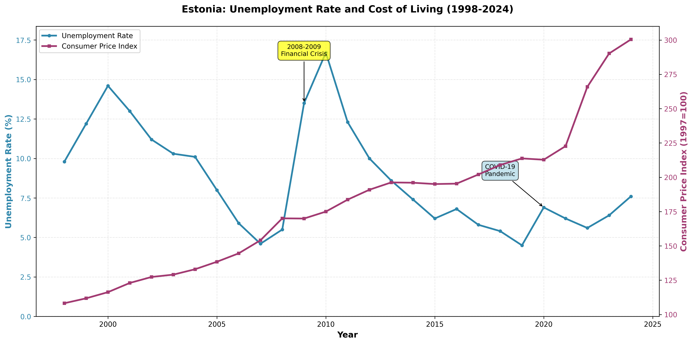

# Estonia: Unemployment and Cost of Living Analysis (1998-2024)

## Executive Summary

This analysis examines the long-term relationship between unemployment and cost of living in Estonia over a 27-year period from 1998 to 2024. The data reveals significant economic cycles, with unemployment peaking during major crises (2008-2009 financial crisis, 2020 COVID-19 pandemic) while the cost of living has shown persistent upward growth. Estonia experienced its lowest unemployment rate (4.5%) in 2019, just before the COVID-19 pandemic, while the Consumer Price Index nearly tripled over the study period.

**Key Findings:**
- Unemployment averaged 8.71% over the period, ranging from 4.5% (2019) to 16.7% (2010)
- Cost of living increased by 177.6% from 1998 to 2024 (average annual growth: 4.01%)
- Two major unemployment spikes: 2009-2010 financial crisis and 2020 COVID-19 pandemic
- Recent surge in cost of living (2022-2024) coinciding with moderate unemployment increase

---

## Data Sources and Methodology

### Data Sources

**Statistics Estonia (Statistikaamet) - Official Government Statistics:**

1. **Unemployment Data (Table TT35 & TT0151)**
   - Table ID: TT35.PX - "Unemployment Rate by Sex and Age Group (1993-2019)"
   - Table ID: TT0151.px - "Labour Market Headline Indicators by Sex and Age Group (2018-2024)"
   - Metric: Unemployment rate for population aged 15-74 years, total (males and females)
   - Coverage: 1998-2024 (27 years)
   - Source: Labour Force Survey conducted by Statistics Estonia

2. **Consumer Price Index Data (Table IA02)**
   - Table ID: IA02.PX - "Consumer Price Index, 1997 = 100 (MONTHS)"
   - Metric: Monthly CPI for all commodity groups, indexed to 1997=100
   - Coverage: 1998-2025 (monthly data aggregated to annual averages)
   - Source: Statistics Estonia price monitoring program

### Methodology

1. **Data Collection:**
   - Unemployment data retrieved from two tables to maximize time coverage (1998-2024)
   - CPI data collected monthly and aggregated to annual averages for consistency
   - Data accessed via Statistics Estonia API (andmed.stat.ee/api/v1)

2. **Data Processing:**
   - Merged unemployment data from archived (TT35) and current (TT0151) tables
   - Calculated annual average CPI from monthly observations
   - Aligned datasets to common time period (1998-2024)

3. **Analysis Approach:**
   - Dual-axis time series visualization showing unemployment rate (%) and CPI (index)
   - Statistical summary including mean, min, max, and growth rates
   - Identification of major economic events and their impacts

---

## Key Findings

### 1. Unemployment Trends

#### Overall Statistics
| Metric | Value | Year |
|--------|-------|------|
| **Average unemployment rate** | 8.71% | 1998-2024 |
| **Lowest unemployment** | 4.5% | 2019 |
| **Highest unemployment** | 16.7% | 2010 |
| **Standard deviation** | 3.4% | - |

#### Major Cycles Identified

**Late 1990s Recovery (1998-2001)**
- Started at 9.8% in 1998
- Rose to 14.6% in 2000 (post-Soviet transition effects, Russian crisis spillover)
- Gradual decline began in 2001

**Pre-Crisis Boom (2002-2008)**
- Steady decline from 11.2% (2002) to 4.6% (2007)
- Economic growth driven by EU accession (2004) and foreign investment
- Labor market tightened significantly

**Financial Crisis Impact (2009-2010)**
- Dramatic spike from 5.5% (2008) to 16.7% (2010)
- Represents a **304% increase** in just 2 years
- Peak unemployment period for entire dataset

**Post-Crisis Recovery (2011-2019)**
- Long, gradual recovery over 9 years
- Declined from 12.3% (2011) to 4.5% (2019)
- Achieved historical low in 2019

**COVID-19 Pandemic (2020-2024)**
- Moderate spike to 6.9% in 2020 (less severe than 2009-2010 crisis)
- Quick partial recovery to 5.6% by 2022
- Recent uptick to 7.6% in 2024

### 2. Cost of Living Trends

#### Overall Statistics
| Metric | Value |
|--------|-------|
| **CPI in 1998** | 108.2 (1997=100) |
| **CPI in 2024** | 300.4 (1997=100) |
| **Total increase** | 177.6% |
| **Average annual growth** | 4.01% |

#### Growth Phases

**Steady Growth Period (1998-2007)**
- Consistent upward trend
- Average annual growth: ~4.2%
- Driven by economic convergence with EU standards

**Financial Crisis Stagnation (2008-2009)**
- Slight deflation in 2009
- CPI remained flat around 170 (first time growth stopped)
- Reflected economic contraction and demand collapse

**Moderate Growth Recovery (2010-2021)**
- Resumed steady growth at ~2.5% annually
- More moderate than pre-crisis period
- Period of economic stabilization

**Recent Surge (2022-2024)**
- Dramatic acceleration in price growth
- **19.5% increase in 2022 alone** (from 222.7 to 265.9)
- **13.3% increase in 2023-2024**
- Likely driven by Ukraine war energy crisis and global inflation

### 3. Relationship Between Unemployment and Cost of Living

#### Observed Correlations

**Inverse Relationship During Crises:**
| Period | Unemployment | CPI Growth | Pattern |
|--------|--------------|------------|---------|
| 2008-2010 | ↑ 204% increase | ↓ Stagnated | Crisis reduces demand → price stabilization |
| 2020 | ↑ 27% increase | ↓ Slight decline | COVID shock → deflationary pressure |

**Parallel Growth in Normal Times:**
| Period | Unemployment | CPI | Pattern |
|--------|--------------|-----|---------|
| 2011-2019 | ↓ Declined to 4.5% | ↑ Steady growth | Economic expansion → wage growth → inflation |
| 2022-2024 | ↑ Rising to 7.6% | ↑ Rapid acceleration | Stagflation signals |

#### Key Insight: Recent Stagflation Concerns (2022-2024)

Unlike previous patterns, the 2022-2024 period shows **simultaneous increase in both unemployment and cost of living**:
- Unemployment rose from 5.6% (2022) to 7.6% (2024): +36% increase
- CPI rose from 265.9 to 300.4: +13% increase

This pattern suggests stagflationary pressures, where economic growth slows while prices continue rising - a challenging policy environment.

---

## Visualization



The chart clearly illustrates:
- **Blue line** (left axis): Unemployment rate showing two major peaks (2010, 2020)
- **Purple line** (right axis): Consumer Price Index showing consistent upward trend
- **Yellow annotation**: 2008-2009 Financial Crisis marking the highest unemployment period
- **Blue annotation**: COVID-19 Pandemic showing moderate impact compared to financial crisis

---

## Detailed Data

### Annual Unemployment Rate and Consumer Price Index (1998-2024)

| Year | Unemployment Rate (%) | CPI (1997=100) | CPI Change from Previous Year |
|------|----------------------|----------------|------------------------------|
| 1998 | 9.8 | 108.2 | - |
| 1999 | 12.2 | 111.8 | +3.3% |
| 2000 | 14.6 | 116.3 | +4.0% |
| 2001 | 13.0 | 123.0 | +5.7% |
| 2002 | 11.2 | 127.3 | +3.5% |
| 2003 | 10.3 | 129.0 | +1.3% |
| 2004 | 10.1 | 133.0 | +3.1% |
| 2005 | 8.0 | 138.4 | +4.1% |
| 2006 | 5.9 | 144.5 | +4.4% |
| 2007 | 4.6 | 154.1 | +6.6% |
| 2008 | 5.5 | 170.1 | +10.4% |
| 2009 | 13.5 | 169.9 | -0.1% |
| 2010 | 16.7 | 175.0 | +3.0% |
| 2011 | 12.3 | 183.7 | +5.0% |
| 2012 | 10.0 | 190.9 | +3.9% |
| 2013 | 8.6 | 196.2 | +2.8% |
| 2014 | 7.4 | 196.0 | -0.1% |
| 2015 | 6.2 | 195.0 | -0.5% |
| 2016 | 6.8 | 195.3 | +0.2% |
| 2017 | 5.8 | 202.0 | +3.4% |
| 2018 | 5.4 | 208.9 | +3.4% |
| 2019 | 4.5 | 213.7 | +2.3% |
| 2020 | 6.9 | 212.8 | -0.4% |
| 2021 | 6.2 | 222.7 | +4.6% |
| 2022 | 5.6 | 265.9 | +19.4% |
| 2023 | 6.4 | 290.2 | +9.1% |
| 2024 | 7.6 | 300.4 | +3.5% |

**Data exported to:** `unemployment_and_cpi_data.csv`

---

## Conclusions and Insights

### Major Findings

1. **Estonia's Labor Market is Highly Responsive to Global Shocks**
   - The 2008-2009 financial crisis had a severe impact (unemployment tripled)
   - COVID-19 impact was more moderate, suggesting better economic resilience or policy response
   - Recovery periods tend to be gradual (9 years post-2009 crisis)

2. **Cost of Living Has Nearly Tripled in 27 Years**
   - From CPI of 108.2 (1998) to 300.4 (2024)
   - Represents significant erosion of purchasing power if wages didn't keep pace
   - Recent acceleration (2022-2024) is particularly concerning

3. **Traditional Crisis Pattern: High Unemployment → Price Stability**
   - Both major crises (2009, 2020) showed this pattern
   - Economic contraction reduces demand and inflationary pressure
   - Provides some relief for those who remain employed

4. **Emerging Concern: Stagflation Signals (2022-2024)**
   - Rising unemployment alongside rising prices
   - Suggests supply-side issues (energy costs, supply chain disruptions)
   - More difficult policy environment than traditional demand-driven recession

5. **Pre-Pandemic Achievement: Historic Low Unemployment (2019)**
   - 4.5% unemployment was the lowest in the entire 27-year period
   - Demonstrated strong economic fundamentals before COVID-19
   - CPI growth was moderate and sustainable at this time

### Policy Implications

- **Wage Policy**: With CPI nearly tripling, wage growth monitoring is critical
- **Economic Resilience**: Estonia showed faster recovery from COVID-19 than from 2008-2009 crisis
- **Current Challenges**: Addressing simultaneous unemployment rise and inflation requires balanced approach
- **Future Monitoring**: Watch for continued stagflationary trends or return to normal patterns

### Data Quality Notes

- Data represents population aged 15-74 years
- Unemployment figures are based on ILO definition (Labour Force Survey)
- CPI represents all commodity groups with 1997 base year
- Monthly CPI data aggregated to annual averages for consistency
- Data sources: Statistics Estonia official government statistics

---

## Appendix: Data Access

### API Queries Used

**Unemployment Data (1993-2019):**
```bash
curl -X POST "https://andmed.stat.ee/api/v1/en/stat/TT35" \
  -H "Content-Type: application/json" \
  -d '{"query":[{"code":"Sugu","selection":{"filter":"item","values":["1"]}},
               {"code":"Vanuserühm","selection":{"filter":"item","values":["5"]}},
               {"code":"Aasta","selection":{"filter":"all","values":["*"]}}],
       "response":{"format":"json-stat2"}}'
```

**Unemployment Data (2018-2024):**
```bash
curl -X POST "https://andmed.stat.ee/api/v1/en/stat/TT0151" \
  -H "Content-Type: application/json" \
  -d '{"query":[{"code":"Näitaja","selection":{"filter":"item","values":["UNEMP_RATE"]}},
               {"code":"Sugu","selection":{"filter":"item","values":["T"]}},
               {"code":"Vanuserühm","selection":{"filter":"item","values":["Y15-74"]}},
               {"code":"Vaatlusperiood","selection":{"filter":"all","values":["*"]}}],
       "response":{"format":"json-stat2"}}'
```

**Consumer Price Index Data:**
```bash
curl -X POST "https://andmed.stat.ee/api/v1/en/stat/IA02" \
  -H "Content-Type: application/json" \
  -d '{"query":[{"code":"Kaubagrupp","selection":{"filter":"item","values":["1"]}},
               {"code":"Aasta","selection":{"filter":"all","values":["*"]}},
               {"code":"Kuu","selection":{"filter":"all","values":["*"]}}],
       "response":{"format":"json-stat2"}}'
```

### Files Generated

- `unemployment_and_cpi_chart.png` - Main visualization (300 DPI)
- `unemployment_and_cpi_data.csv` - Raw data export
- `unemployment_1993_2019.json` - API response (archived unemployment data)
- `unemployment_2018_2024.json` - API response (current unemployment data)
- `cpi_data.json` - API response (CPI monthly data)
- `process_and_visualize.py` - Data processing and visualization script

---

**Analysis Date:** January 11, 2026
**Data Source:** Statistics Estonia (Statistikaamet) - https://andmed.stat.ee
**Analysis Tool:** Python 3 with matplotlib and numpy
