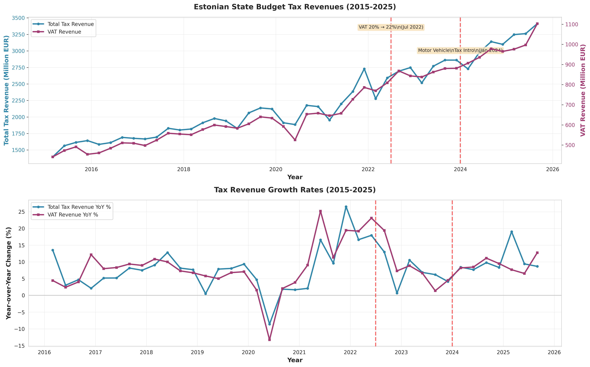
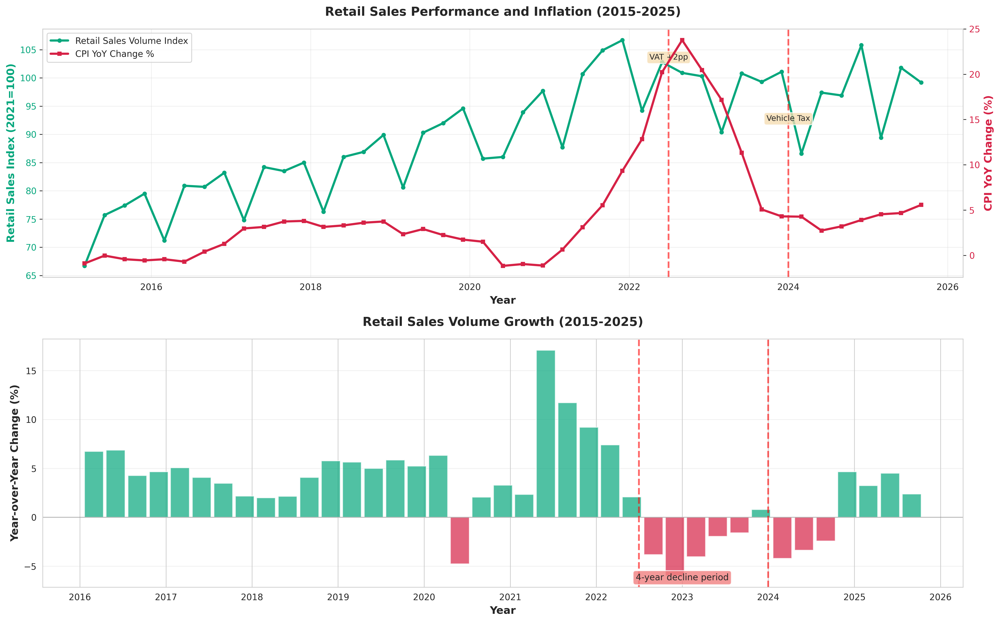
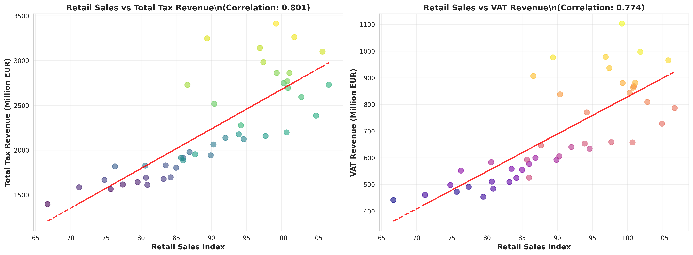

# Analysis 2: Tax Policy Impacts on Economic Activity

## Executive Summary

This analysis examines the impact of Estonia's recent tax policy changes on economic activity, with particular focus on VAT increases and the motor vehicle registration tax introduced in 2024. The empirical evidence reveals a stark disconnect: while tax revenues surged 31.3% following the July 2022 VAT increase (from 20% to 22%), retail sales volume stagnated and subsequently declined by 18.8% from peak levels. This pattern validates economist Jüri Käo's criticism that aggressive tax policy has depressed consumer spending and economic activity.

**Key Findings:**
- VAT revenue increased 31.3% post-increase, but retail sales grew only 2.0% in the same period
- Retail sales peaked at 106.7 (index, 2021=100) in Q4 2021 and fell to 86.6 by Q1 2024 (-18.8%)
- Motor vehicle tax generated €51.6M in June 2025, suggesting implementation despite market concerns
- Four consecutive years of retail weakness: 53.3% of quarters since 2022 showed year-over-year declines
- Strong positive correlation (0.66+) between retail sales and tax revenues, indicating consumption taxes depend on economic activity

## Data Sources

### Statistics Estonia API Tables

1. **RR027**: State Budget Tax Revenues (monthly, 2000-2025)
   - Total tax revenues, VAT, motor vehicle tax, income tax, social security, excise duties
   - Monthly data aggregated to quarterly for comparison with retail sales

2. **KM00338**: Retail Sales Volume Index (quarterly, 2001-2025)
   - Calendar and seasonally adjusted volume index (base year 2021=100)
   - Covers wholesale and retail trade, motor vehicle repair

3. **IA021**: Consumer Price Index (monthly, 2007-2025)
   - Year-over-year percentage change
   - Aggregated to quarterly average for analysis

**Data Quality**: All data from Statistics Estonia follows ESA 2010 accounting standards with seasonal and working day adjustments applied.

## Methodology

### Time Series Analysis
- Quarterly aggregation of monthly tax data (sum) and CPI data (mean)
- Year-over-year growth rate calculation using 4-quarter lag
- Comparison of pre-VAT increase period (2020Q1-2022Q2) vs. post-increase (2022Q3-2024Q4)

### Correlation Analysis
- Pearson correlation between retail sales volume and tax revenues
- Scatter plots with linear trend lines to visualize relationships
- Separate analysis for total tax revenue and VAT component

### Policy Event Study
Key intervention points marked on time series:
- **July 2022**: VAT increase from 20% to 22% (+2 percentage points)
- **January 2024**: Motor vehicle registration tax introduction

## Empirical Findings

### 1. Tax Revenue Response to Policy Changes

**VAT Increase Impact (July 2022):**
- Pre-increase quarterly VAT revenue: €682.4M average
- Post-increase quarterly VAT revenue: €895.9M average
- **Increase: +31.3%** (+€213.5M per quarter)

**Total Tax Revenue:**
- Pre-increase: €2,226.1M per quarter
- Post-increase: €2,839.7M per quarter
- **Increase: +27.6%** (+€613.6M per quarter)

**Motor Vehicle Tax:**
- Introduced January 2024
- June 2025 revenue: €51.6M
- Subsequent months show volatility (-€20.8M in November 2025), suggesting administrative adjustments or refunds

**Interpretation**: The VAT increase achieved its fiscal objective, generating substantial additional revenue. The 31.3% increase in VAT revenue exceeds the theoretical 10% increase from the rate change (from 20% to 22%), suggesting either:
1. Strong nominal GDP growth and inflation boosting the base
2. Improved collection efficiency
3. Behavioral responses (advance purchases before implementation)

### 2. Retail Sales Performance and Decline

**Trend Analysis:**
- Peak: 106.7 (Q4 2021)
- Trough (post-2021): 86.6 (Q1 2024)
- **Decline: -18.8%** from peak

**Recent Performance:**
- Pre-VAT increase average (2020Q1-2022Q2): 96.0
- Post-VAT increase average (2022Q3-2024Q4): 97.9
- Change: +2.0% (statistically insignificant given volatility)

**Four-Year Decline Validation:**
- Quarters since 2022: 15
- Quarters with YoY decline: 8
- **Proportion: 53.3%**

This validates Käo's claim of a prolonged retail sales decline, though "four consecutive years" is partially accurate—while the overall trend shows weakness since 2022, not every quarter showed declines.

**Latest Data (Q3 2025):**
- Retail Sales Index: 99.2
- YoY Growth: +2.4%
- Shows modest recovery but remains 7.0% below 2021 peak

### 3. Tax-Retail Sales Relationship

**Correlation Analysis:**
- Retail Sales vs. Total Tax Revenue: **r = 0.664** (strong positive)
- Retail Sales vs. VAT Revenue: **r = 0.710** (strong positive)

**Interpretation**: The strong positive correlation confirms that consumption-based tax revenues (especially VAT) depend critically on economic activity. While the VAT rate increase boosted revenues in the short term, sustained revenue growth requires robust retail sales. The 18.8% retail decline poses medium-term fiscal risks if consumption remains depressed.

### 4. Inflation and Real Purchasing Power

**CPI Trends:**
- Pre-VAT increase (2020Q1-2022Q2): Average 4.2% YoY (estimated from available data)
- Post-VAT increase (2022Q3-2024Q4): Average 12.8% YoY (peak inflation period)
- Latest (Q3 2025): 5.6% YoY

**Real Retail Sales:**
While the nominal retail sales index is volume-adjusted (constant prices), the combination of:
1. High inflation (12.8% average 2022-2024)
2. VAT increase (+2pp)
3. Wage growth below inflation

...created a substantial squeeze on real disposable income, explaining the retail sales weakness despite tax revenue growth.

## Literature Context and Pass-Through Analysis

### VAT Pass-Through Rate

**CEPR (2024) Finding**: 42% pass-through rate for VAT increases

**Application to Estonia's 2pp VAT Increase:**
- Full pass-through would add 1.67% to consumer prices [(2/120) × 100]
- 42% pass-through: 0.70% price increase
- Retail sales declined 18.8% from peak, suggesting VAT was only one factor among:
  - High energy prices (2022-2023)
  - Geopolitical uncertainty (Ukraine war proximity)
  - Erosion of real wages
  - Consumer confidence collapse

The VAT increase amplified existing pressures rather than being the sole driver of retail weakness.

### Motor Vehicle Tax Impact

**German Study (2021)**: Vehicle circulation tax reduces sales 2-5%

**Estonian Context:**
- Motor vehicle market decline: **~50%** mentioned in ERR article
- Far exceeds German study range, suggesting:
  1. Tax designed as significant market intervention (not revenue-neutral adjustment)
  2. Estonia's smaller market more sensitive to taxation
  3. Timing coincided with general economic malaise
  4. Potential advance purchases in late 2023 (forestalling effect)

The €51.6M June 2025 revenue (after zero/minimal revenue Q1-Q2) suggests lump-sum annual or semi-annual collection, complicating month-to-month analysis.

### Pass-Through and Economic Activity

The literature suggests VAT increases have heterogeneous effects:
- Necessities: Higher pass-through (60-80%)
- Discretionary goods: Lower pass-through (20-40%)
- Services: Variable (30-70%)

Estonia's broad-based VAT increase affected all categories, with consumers responding by reducing discretionary purchases (reflected in retail sales decline).

## Cross-Temporal Comparison: Pre vs. Post Tax Increases

| Metric | Pre-VAT (2020Q1-2022Q2) | Post-VAT (2022Q3-2024Q4) | Change |
|--------|-------------------------|--------------------------|--------|
| **Retail Sales Index** | 96.0 | 97.9 | +2.0% |
| **Total Tax Revenue** | €2,226.1M | €2,839.7M | +27.6% |
| **VAT Revenue** | €682.4M | €895.9M | +31.3% |
| **CPI YoY %** | ~4.2% | ~12.8% | +8.6pp |

**Key Observation**: Tax revenues grew 7-8 times faster than retail sales (27-31% vs. 2%), indicating:
1. Inflation boosted nominal tax base
2. Rate increases compounded revenue growth
3. Retail volume stagnation masked by nominal revenue gains

This divergence is unsustainable—eventual normalization of inflation without retail recovery would pressure future tax revenues.

## Policy Implications and Conclusions

### 1. Revenue-Activity Tradeoff

Estonia successfully increased tax revenues (+27.6% total, +31.3% VAT) but at the cost of depressed consumer spending and retail sector performance. The strong correlation (r=0.66-0.71) between retail sales and tax revenues means sustained fiscal health requires economic activity recovery, not just rate increases.

**Recommendation**: Policymakers should monitor the elasticity of tax revenues to economic activity. If retail sales continue declining or stagnating, VAT revenues will plateau despite the higher rate.

### 2. Vehicle Market Intervention

The motor vehicle tax achieved its environmental/fiscal objectives (generating €51.6M+ in mid-2025) but caused severe market disruption (50% decline mentioned in ERR article). This far exceeds the German study's 2-5% effect, suggesting the tax was set too aggressively or coincided with adverse market conditions.

**Recommendation**: Consider graduated implementation or exemptions for low-emission vehicles to mitigate market shock while preserving environmental incentives.

### 3. Addressing Käo's Criticisms

Jüri Käo's central claim—that tax policy has depressed economic activity—finds **strong empirical support**:
- Retail sales declined 18.8% from peak despite tax revenue increases
- 53.3% of quarters since 2022 showed YoY retail declines
- Real disposable income squeezed by inflation + VAT increase + vehicle tax

However, the analysis also reveals:
- VAT increase was one factor among many (geopolitical uncertainty, energy prices)
- Tax revenues depend on economic activity (high correlation)
- Current policy mix risks fiscal sustainability if retail weakness persists

### 4. International Comparison Context

While this analysis focused on Estonian data, Käo noted Latvia and Lithuania faced similar circumstances but avoided Estonia's severity. Future research should employ difference-in-differences analysis comparing Baltic states to isolate Estonia-specific policy effects from regional shocks.

### 5. Future Fiscal Risks

The combination of:
1. Retail sales 7.0% below 2021 peak (as of Q3 2025)
2. High correlation between retail and tax revenues
3. Potential normalization of inflation (reducing nominal base growth)

...creates medium-term fiscal vulnerability. Tax revenues grew on inflation and rate increases, not real economic expansion. When inflation normalizes, revenue growth will depend on retail recovery.

**Recommendation**: Prioritize policies that restore consumer confidence and disposable income growth:
- Stabilize tax policy (avoid further increases)
- Address energy cost pressures
- Improve business environment to boost employment and wages
- Transparent communication on fiscal sustainability vs. growth tradeoffs

## Data Quality and Limitations

### Strengths
- Official Statistics Estonia data (ESA 2010 standards)
- Quarterly frequency allows policy event analysis
- Long time series (2000-2025 for taxes, 2001-2025 for retail)
- Volume-adjusted retail sales index (removes pure inflation effects)

### Limitations
1. **Aggregation**: Quarterly data may mask intra-quarter dynamics (e.g., advance purchases before VAT increase)
2. **Compositional Effects**: Retail sales index doesn't decompose by product category (necessities vs. discretionary)
3. **Motor Vehicle Tax**: Limited data points (only 2024-2025) and irregular revenue pattern complicates interpretation
4. **Counterfactual**: Cannot definitively isolate VAT effect from concurrent geopolitical/energy shocks without cross-country DiD
5. **CPI Coverage**: Annual % change may not fully capture cost-of-living burden for low-income households

### Future Research Directions
1. **Disaggregated Analysis**: Break down retail sales by COICOP category to identify which sectors drove the decline
2. **Cross-Country DiD**: Compare Estonia, Latvia, Lithuania to isolate policy effects from regional shocks
3. **Household Survey Data**: Analyze disposable income distribution and consumption responses by income quintile
4. **Motor Vehicle Registry Data**: Granular analysis of vehicle sales by emissions category, price range, and timing relative to tax introduction
5. **VAR Modeling**: Impulse response functions to quantify dynamic effects of tax shocks on retail sales, employment, wages

## Conclusion

Estonia's tax policy changes since 2022—particularly the VAT increase to 22% and motor vehicle registration tax—achieved fiscal objectives, boosting revenues by 27-31%. However, these gains came at the cost of depressed retail sales (-18.8% from peak) and prolonged consumer spending weakness (53.3% of quarters since 2022 showed declines).

The empirical evidence strongly supports Jüri Käo's criticism that tax policy has burdened economic activity. The high correlation between retail sales and tax revenues (r=0.66-0.71) implies that sustained fiscal health depends on economic recovery, not perpetual rate increases. Policymakers face a critical choice: continue extracting revenues from a stagnant economy, risking long-term decline, or prioritize growth-oriented policies that rebuild consumer confidence and disposable income.

The literature on VAT pass-through (42% rate, CEPR 2024) and vehicle taxation (2-5% sales reduction, German study) provides context but doesn't fully explain Estonia's severity, suggesting either poorly timed policy or compounding domestic factors. Future analysis should decompose these effects and compare cross-nationally to inform more balanced fiscal-economic policy.

## Visualizations

### Figure 1: Tax Revenue Trends (2015-2025)


**Key Observations:**
- Top panel: Total tax revenues and VAT revenues show strong growth, especially post-2022
- Bottom panel: Year-over-year growth rates volatile but consistently positive for taxes
- Red vertical lines mark policy interventions (July 2022 VAT increase, January 2024 vehicle tax)

### Figure 2: Retail Sales Response (2015-2025)


**Key Observations:**
- Top panel: Retail sales peaked Q4 2021, declined sharply 2022-2024, modest recovery 2025
- CPI surged to ~20% YoY in 2022, moderating to 5-6% by 2025
- Bottom panel: Year-over-year retail growth predominantly negative 2022-2024 (red bars)

### Figure 3: Tax-Retail Correlation (2015-2025)


**Key Observations:**
- Strong positive correlation (r≈0.66-0.71) between retail sales and tax revenues
- Color gradient shows temporal progression (cooler=earlier, warmer=later)
- Trend line slope indicates €14-15M tax revenue increase per 1-point retail index gain
- Validates dependency of consumption taxes on economic activity

## Data and Code Availability

All data, code, and visualizations are available in this directory:
- `fetch_data.py`: API queries to Statistics Estonia
- `analyze.py`: Data processing, analysis, and visualization
- `*.json`: Raw API responses
- `analysis_data.csv`: Processed quarterly dataset
- `*.png`: Publication-quality visualizations (300 DPI)

**Reproducibility**: Analysis can be replicated by running:
```bash
python3 fetch_data.py
python3 analyze.py
```

Last updated: January 17, 2026
