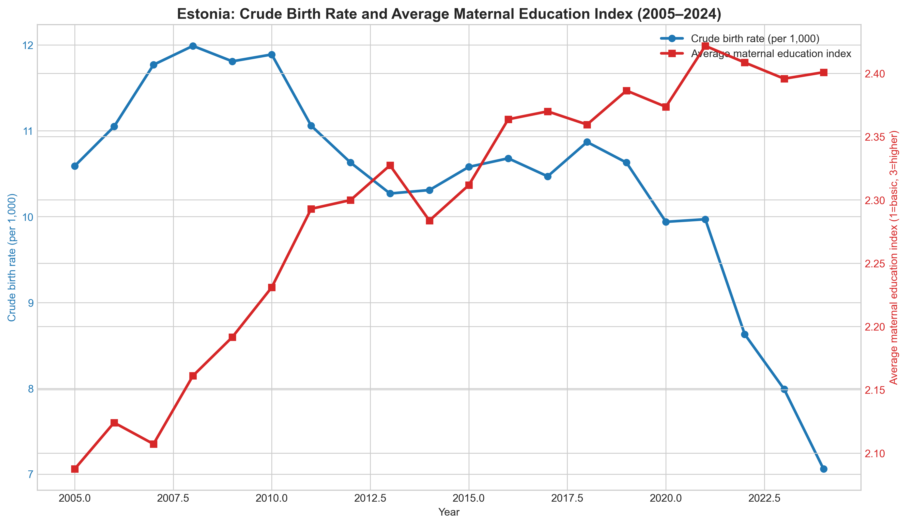

# Statistics Estonia: Birth Rates and Maternal Education (2005–2024)

## Executive summary
- Estonia’s crude birth rate declined from 10.59 per 1,000 in 2005 to 7.06 in 2024 (−33.3%).
- The derived average maternal education index rose from 2.087 to 2.401 over the same period (+15.0%), indicating a shift toward higher educational attainment among mothers.
- Across the 20-year window, higher maternal education coincides with a lower crude birth rate (correlation ≈ −0.65), which is descriptive and not causal.

## Data sources and methodology
- **Primary tables (Statistics Estonia API):**
  - **RV030** – *Births, deaths and natural increase*: crude birth rate (per 1,000 population).
  - **RV144 (2005–2016)** and **RV144U (2017–2024)** – *Live births by age and educational level of mother and county*.
- **Metadata (ESMS):**
  - RV030 metadata ID **30205** and RV144U metadata ID **30206** were retrieved via `get_metadata.py`.
  - RV144 is an archived table and did not return ESMS metadata via the script.
- **Time window:** 2005–2024 (last 20 years available in RV030).
- **Maternal education index (derived):**
  - Education categories used: *Primary or basic*, *Secondary*, *Higher*.
  - Weighted index = (1×Primary + 2×Secondary + 3×Higher) / (Primary + Secondary + Higher).
  - “Educational level unknown” is excluded from the weighted index but tracked as a share of total births.
- **Aggregation:** births are summed across counties to get national totals; age group set to “Age groups total”.

## Key findings

### Snapshot (selected years)
| Year | Crude birth rate (per 1,000) | Avg maternal education index | Unknown edu share (%) |
| --- | --- | --- | --- |
| 2005 | 10.59 | 2.087 | 0.007 |
| 2010 | 11.89 | 2.231 | 0.063 |
| 2015 | 10.58 | 2.312 | 0.870 |
| 2020 | 9.94 | 2.374 | 0.061 |
| 2024 | 7.06 | 2.401 | 0.062 |

### Extremes (2005–2024)
| Metric | Min (year, value) | Max (year, value) |
| --- | --- | --- |
| Crude birth rate (per 1,000) | 2024: 7.06 | 2008: 11.99 |
| Avg maternal education index | 2005: 2.087 | 2021: 2.422 |

### Observations
- Birth rates peaked in 2008 and trended downward after the late‑2000s.
- The maternal education index increases steadily, with the highest value in 2021.
- The share of “education unknown” is generally low (<1% in most years), but it spikes to ~4.1% in 2013, so the education index that year is slightly less reliable.

## Data visualizations

*Figure: Crude birth rate (left axis) and average maternal education index (right axis), 2005–2024.*

## Conclusions and insights
- The long‑run decline in crude birth rates is clear, while maternal educational attainment among mothers has risen.
- The two series move in opposite directions over time, suggesting a structural demographic shift; however, the relationship is descriptive and should not be interpreted causally.
- For policy analysis, deeper work would link cohort size, fertility timing, and educational composition rather than crude birth rates alone.
